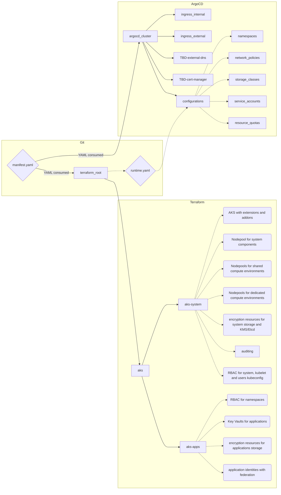
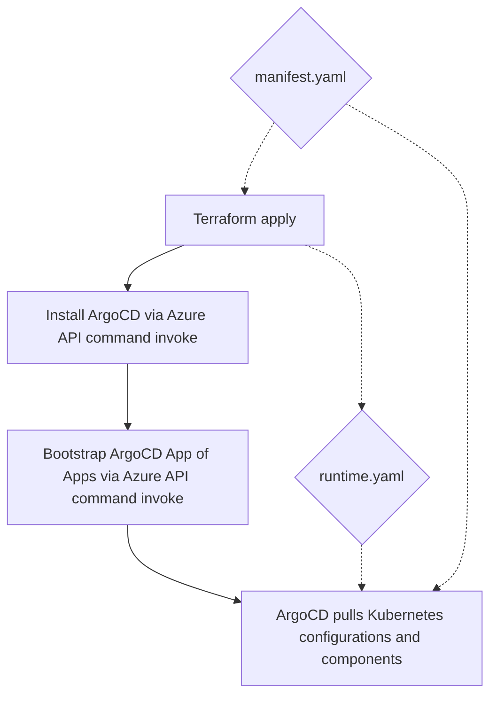

# AKS as a Service
This repository contains demo for platform teams in enterprise organizations on how to manage multiple AKS clusters and provide features like Namespace as a Service. It is focused on high security demand organizations requiring advanced isolation of resources. Goal is to streamline provisioning and full lifecycle management of resources including cloud services (managed by Terraform) and Kubernetes resources (packaged as Helm charts and managed by ArgoCD).

Design goals:
- Provide Namespace as a Service capability by giving team or application access only to their namespace.
- Design for two tiers of applications with different isolation and security requirements - standard (can use some shared components such as nodepool or subnet) and confidential (require strong isolation on node level, subnet level etc.).
- For single source of truth provide YAML manifest with all cluster parameters (shared components, namespaces, applications) that will be consumed by both Azure resources deployment (Terraform) and Kubernetes resources deployment (ArgoCD).
- Each application will use its own namespace that is network isolated from others and only communication allowed is via Ingress or Azure API Management self-hosted gateway.
- Each application will use its own storage classess with separated encryption keys stored in separated Key Vault.
- Each application will use its own Key Vault for storing secrets.
- Each application will use its own User Managed Identity in Azure that will be mapped to Service Account and configured for workload identity federation (this is used for access to Key Vault secrets and can be configured for access to databases, blob storage, queues and other Azure services).
- Policies are defined as code with ability to manage exceptions in manifest YAML.
- AKS is deployed in private cluster mode with Azure Private DNS integration.

## Desired state architecture
Here is architecture of desired state solution using Terraform hierarchical modules and hierarchical "apps" in ArgoCD.



## Automation steps


## Deploy solution
CI/CD is TBD and will be part of this repo.

For manual steps see [./docs/deployment.md](./docs/deployment.md)

## Demonstration and testing
For testing and demonstration see [here](./demo_kube/README.md)

## Development
1. Create new branch
2. Modify file charts/argocd_bootstrap/templates/argocd_cluster.yaml to point to your new branch by changing targetRevision
3. Modify file charts/argocd_cluster/templates/configurations.yaml to point to your new branch by changing targetRevision
4. Modify file charts/argocd_cluster/templates/apim_gw.yaml to point to your new branch by changing targetRevision
5. Re-bootstrap your ArgoCD by
```
export REPO_TOKEN=mytoken
cd ../../charts/argocd_bootstrap/
az aks command invoke -n cluster01 -g cluster01 -f . -c \
    "kubectl create namespace argocd; 
    kubectl apply -n argocd -f https://raw.githubusercontent.com/argoproj/argo-cd/master/manifests/install.yaml; 
    helm upgrade -i argocd-bootstrap . --set repo_token=$REPO_TOKEN --set cluster_name=cluster01"
```
Now you can develop Terraform code, Helm templates etc. When merging back to main discard changes in targetRevision (or modify it back to "main").

When modifying Terraform variables or adding modules, run generate_docs.tf to regenerate Terraform documentation.


## Compute isolation
See [./docs/compute_isolation.md](./docs/compute_isolation.md)

## Storage encryption and isolation
See [./docs/storage_isolation.md](./docs/storage_isolation.md)

## Network architecture and isolation
See [./docs/network_isolation.md](./docs/network_isolation.md)

## Policies
See [./docs/policies.md](./docs/policies.md)

## Terraform docs
- AKS main module: [./docs/terraform.md](./docs/terraform.md)
- aks-system module: [./modules/aks-system/docs/terraform.md](./modules/aks-system/docs/terraform.md)
- aks-apps-rbac module: [./modules/aks-apps-rbac/docs/terraform.md](./modules/aks-apps-rbac/docs/terraform.md)