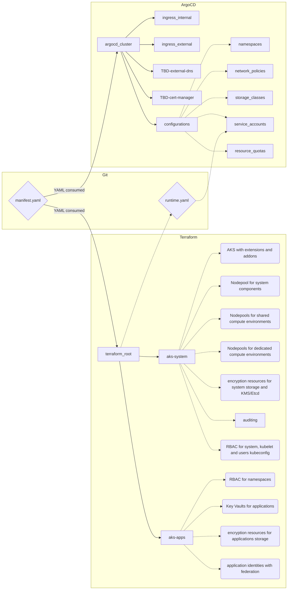
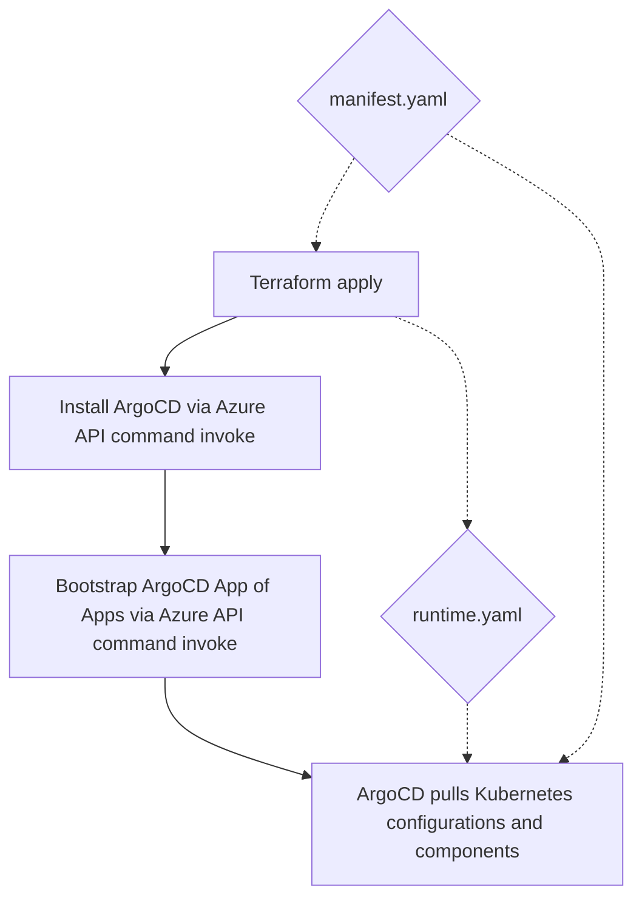
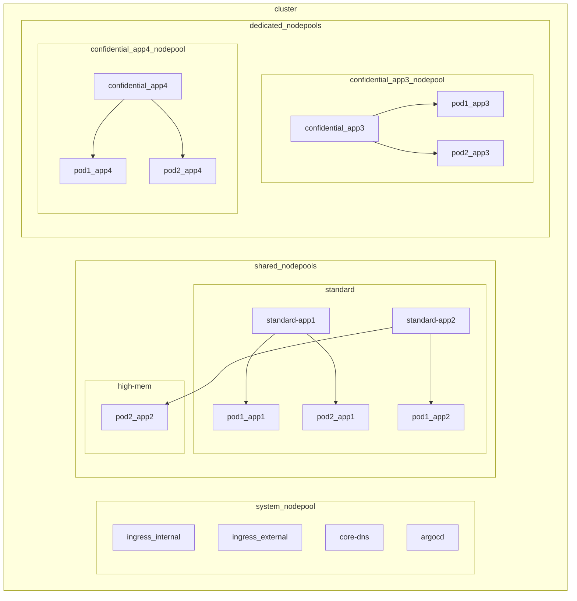
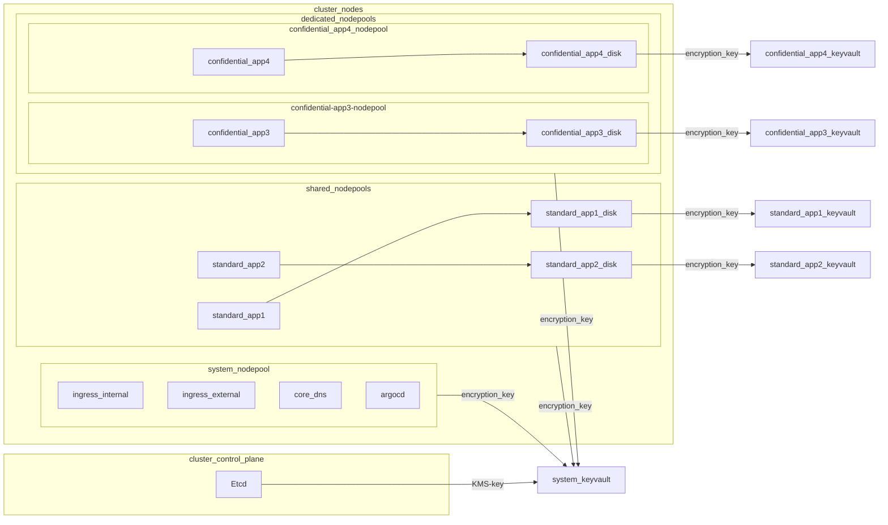
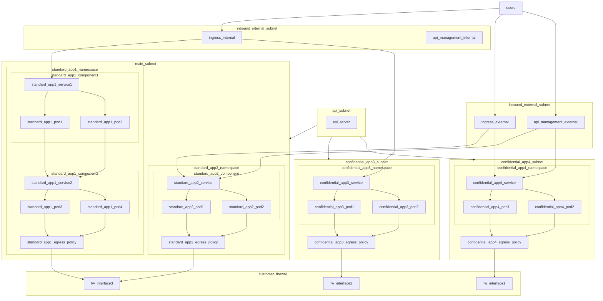

# PoC of enterprise container platform in Azure

## Deploy solution
If you do not have infrastructure (networking and jump server) ready, you can deploy example here:

```bash
# Go to demo infrastructure folder
cd demo_infra

# Deploy infrastructure
terraform init
terraform apply -auto-approve
```

Then deploy cluster. For bootstrapping ArgoCD you do not need line-of-sight to Kubernetes APIs, but you need to create GitHub token than can read our private repo.

```bash
# Go to cluster folder
cd clusters/cluster01

# Deploy infrastructure
terraform init
terraform apply -auto-approve

# Deployment created runtime.yaml in cluster folder, make sure you commit it to Git

# Bootstrap ArgoCD via Azure API (no need to have access to Kubernetes API)
export REPO_TOKEN=mytoken
cd ../../charts/argocd_bootstrap/
az aks command invoke -n cluster01 -g cluster01 -f . -c \
    "kubectl create namespace argocd; 
    kubectl apply -n argocd -f https://raw.githubusercontent.com/argoproj/argo-cd/master/manifests/install.yaml; 
    helm upgrade -i argocd-bootstrap . --set repo_token=$REPO_TOKEN --set cluster_name=cluster01"

```

*Note: at this point there is race condition issue with writing Keys to KeyVault via private endpoint as it takes some time for jump server to get correct private endpoint IP and even when dependency is there it fails. Until we find way how to deal with that simply rerun terraform apply and it will finish.*

For debugging and testing since AKS is private, connect to jump server and work on it. I recommend using satiromarra.code-sftp extension to VS Code to synchronize your local files with jump server on the fly.

```bash
# Debug from jump server

## Connect to jump server
ssh tomas@20.166.57.174

## Get cluster credentials -> admin credentials for testing, will be forbidden in production
az aks get-credentials -n cluster01 -g cluster01 --admin --overwrite

## Port forwarding local to jump (and from there you can forward ArgoCD UI Pod)
ssh -L 8081:127.0.0.1:8080 tomas@20.166.57.174
```

For testing and demonstration see [here](demo_kube/README.md)

## Development
1. Create new branch
2. Modify file charts/argocd_bootstrap/templates/argocd_cluster.yaml to point to your new branch by changing targetRevision
3. Modify file charts/argocd_cluster/templates/configurations.yaml to point to your new branch by changing targetRevision
4. Modify file charts/argocd_cluster/templates/apim_gw.yaml to point to your new branch by changing targetRevision
5. Re-bootstrap your ArgoCD by
```
export REPO_TOKEN=mytoken
cd ../../charts/argocd_bootstrap/
az aks command invoke -n cluster01 -g cluster01 -f . -c \
    "kubectl create namespace argocd; 
    kubectl apply -n argocd -f https://raw.githubusercontent.com/argoproj/argo-cd/master/manifests/install.yaml; 
    helm upgrade -i argocd-bootstrap . --set repo_token=$REPO_TOKEN --set cluster_name=cluster01"
```
1. Now you can develop Terraform code, Helm templates etc. When merging back to main discard changes in targetRevision (or modify it back to "main")

## Desired state architecture


## Automation steps


## Compute isolation


## Storage encryption

    
## Network view


## Policies
10 security policies are implemented
- Policies are applied in default configuration to all applications
- On per-application basis exclusions can be managed:
  - Whole policy can be excluded from application
  - Where possible more granular exclusions are available based on image name/path
- Allowed image policy is applied by default to all applications
- On per-application basis regex list can be overridden
  - Application can get less restrictive by opening access to more paths without allowing the same for other applications
  - Override list replaces default completely so application can get more restrictive eg. by being specific to level of registry/repo/image:tag