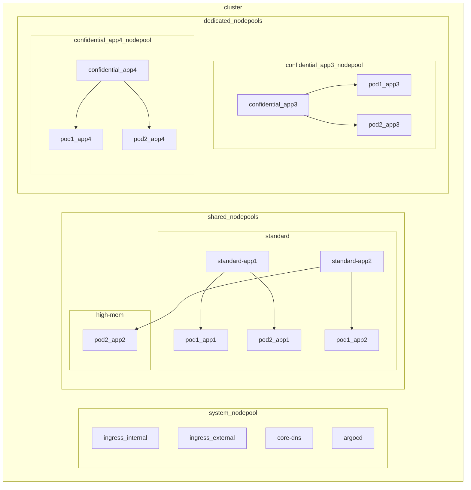

# Compute isolation

```mermaid
flowchart TD
    subgraph cluster
        subgraph system_nodepool
            ingress_internal
            ingress_external
            core-dns
            argocd
        end
        subgraph shared_nodepools
            subgraph standard
                standard-app1 --> pod1_app1
                standard-app1 --> pod2_app1
                standard-app2 --> pod1_app2
            end
            subgraph high-mem
                standard-app2 --> pod2_app2
            end
        end
        subgraph dedicated_nodepools
            subgraph confidential_app3_nodepool
                confidential_app3 --> pod1_app3
                confidential_app3 --> pod2_app3
            end
            subgraph confidential_app4_nodepool
                confidential_app4 --> pod1_app4
                confidential_app4 --> pod2_app4
            end
        end
    end
```