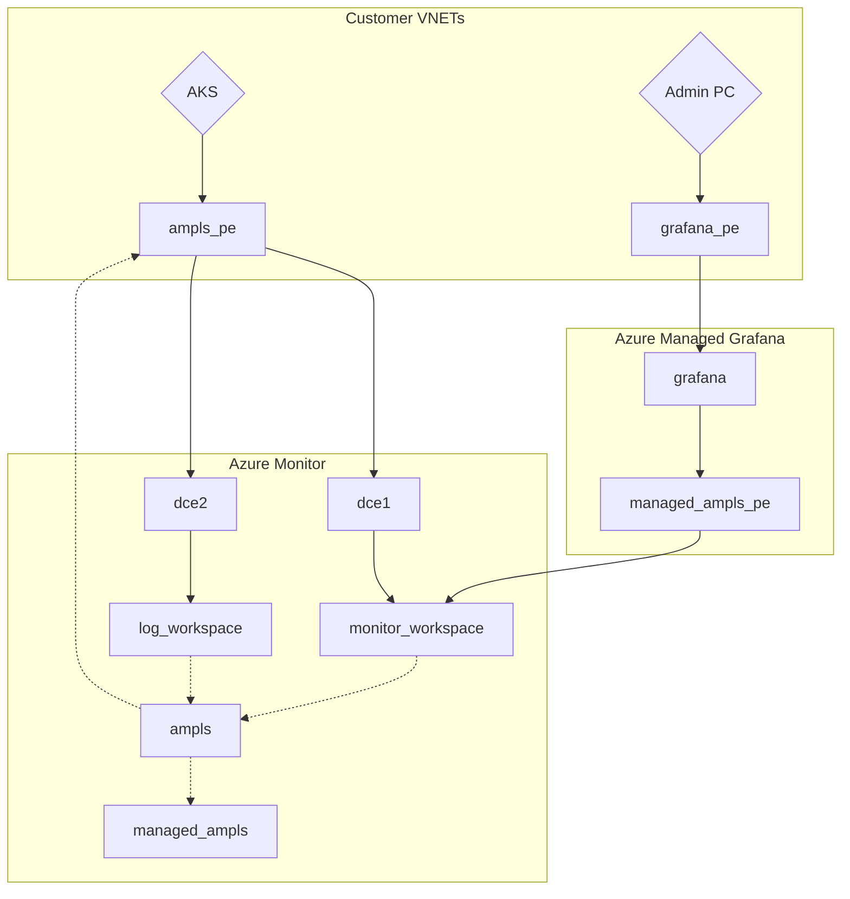

## Automation steps

```mermaid
graph TD;
    subgraph "Customer VNETs"
        ampls_pe
        grafana_pe
        aks{AKS}
        admin_pc{Admin PC}
    end

    subgraph "Azure Managed Grafana"
        grafana --> managed_ampls_pe
    end

    subgraph "Azure Monitor"

    aks{AKS} --> ampls_pe
    ampls .-> ampls_pe
    ampls .-> managed_ampls
    dce1 --> monitor_workspace 
    monitor_workspace .-> ampls
    managed_ampls_pe --> monitor_workspace
    dce2 --> log_workspace 
    log_workspace .-> ampls
    ampls_pe --> dce1
    ampls_pe --> dce2
    
    grafana_pe --> grafana
    admin_pc --> grafana_pe
    end

```