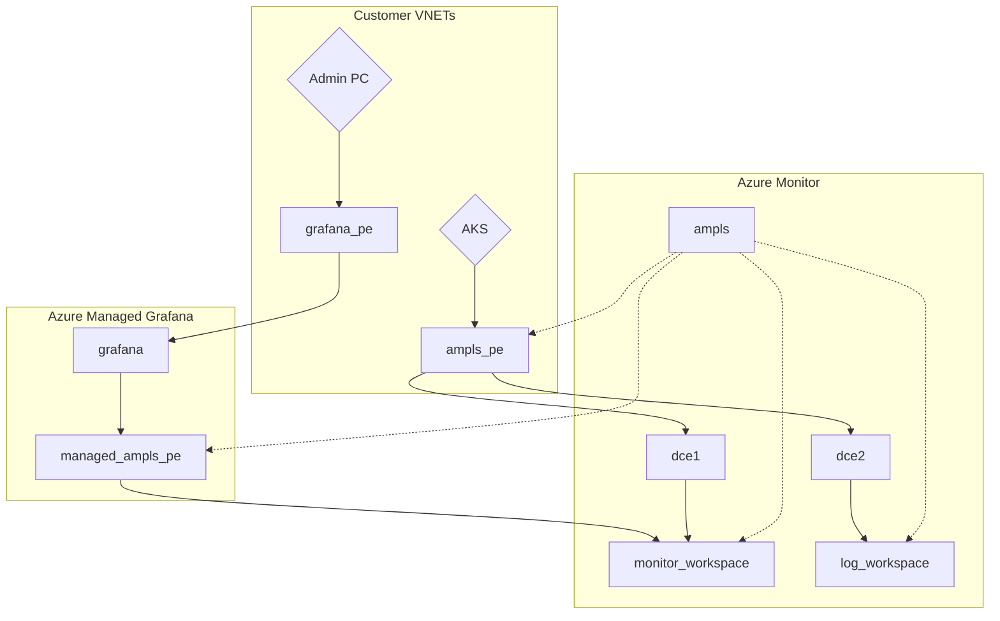

## Automation steps

```mermaid
graph TD;
    subgraph "Customer VNETs"
        ampls_pe
        grafana_pe
        aks{AKS} --> ampls_pe
        admin_pc{Admin PC} --> grafana_pe
    end

    subgraph "Azure Managed Grafana"
        grafana --> managed_ampls_pe
    end

    subgraph "Azure Monitor"
        ampls .-> ampls_pe
        ampls .-> managed_ampls_pe
        ampls .-> monitor_workspace
        ampls .-> log_workspace
        dce1 --> monitor_workspace 
        managed_ampls_pe --> monitor_workspace
        dce2 --> log_workspace 
        ampls_pe --> dce1
        ampls_pe --> dce2
        grafana_pe --> grafana
    end

```