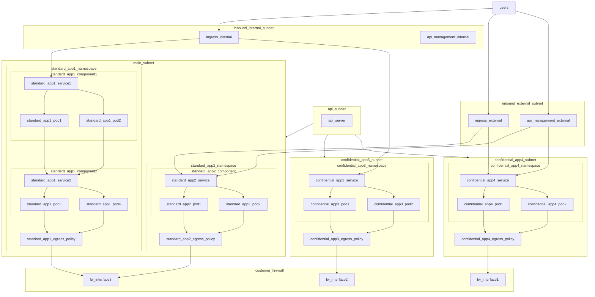

## Network architecture and isolation

```mermaid
flowchart TD
    subgraph api_subnet
        api_server
    end;

    api_subnet --> main_subnet
    api_subnet --> confidential_app3_subnet
    api_subnet --> confidential_app4_subnet

    subgraph main_subnet
        subgraph standard_app1_namespace
            subgraph standard_app1_component1
                standard_app1_service1 --> standard_app1_pod1
                standard_app1_service1 --> standard_app1_pod2
            end
            subgraph standard_app1_component2
                standard_app1_pod1 --> standard_app1_service2
                standard_app1_pod2 --> standard_app1_service2
                standard_app1_service2 --> standard_app1_pod3
                standard_app1_service2 --> standard_app1_pod4
            end
            standard_app1_pod3 --> standard_app1_egress_policy
            standard_app1_pod4 --> standard_app1_egress_policy
        end
        subgraph standard_app2_namespace
            subgraph standard_app2_component
                standard_app2_service --> standard_app2_pod1
                standard_app2_service --> standard_app2_pod2
            end
            standard_app2_pod1 --> standard_app2_egress_policy
            standard_app2_pod2 --> standard_app2_egress_policy
        end
    end

    subgraph confidential_app3_subnet
        subgraph confidential_app3_namespace
            confidential_app3_service --> confidential_app3_pod1
            confidential_app3_service --> confidential_app3_pod2
        end
        confidential_app3_pod1 --> confidential_app3_egress_policy
        confidential_app3_pod2 --> confidential_app3_egress_policy
    end
    subgraph confidential_app4_subnet
        subgraph confidential_app4_namespace
            confidential_app4_service --> confidential_app4_pod1
            confidential_app4_service --> confidential_app4_pod2
        end
        confidential_app4_pod1 --> confidential_app4_egress_policy
        confidential_app4_pod2 --> confidential_app4_egress_policy
    end

    subgraph inbound_internal_subnet
        ingress_internal
        api_management_internal
    end
    subgraph inbound_external_subnet
        ingress_external
        api_management_external
    end
    users --> ingress_internal
    users --> ingress_external
    users --> api_management_external
    ingress_internal --> standard_app1_service1
    ingress_external --> standard_app2_service
    ingress_internal --> confidential_app3_service
    ingress_external --> confidential_app4_service
    api_management_external --> standard_app2_service
    api_management_external --> confidential_app4_service

    subgraph customer_firewall
        confidential_app4_egress_policy --> fw_interface1
        confidential_app3_egress_policy --> fw_interface2
        standard_app1_egress_policy --> fw_interface3
        standard_app2_egress_policy --> fw_interface3
    end
```
