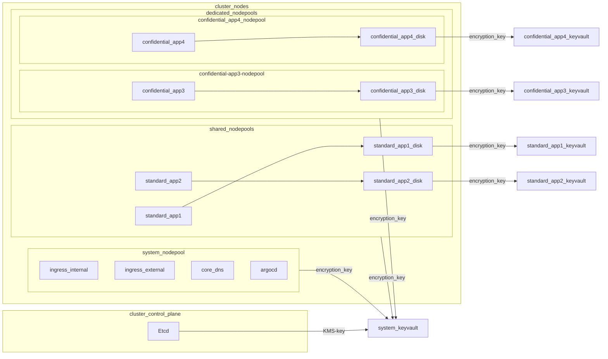

## Storage encryption and isolation

```mermaid
flowchart LR
    subgraph cluster_nodes
        subgraph system_nodepool
            ingress_internal
            ingress_external
            core_dns
            argocd
        end
        subgraph shared_nodepools
            standard_app1 --> standard_app1_disk
            standard_app2 --> standard_app2_disk
        end
        subgraph dedicated_nodepools
            subgraph confidential-app3-nodepool
                confidential_app3 --> confidential_app3_disk
            end
            subgraph confidential_app4_nodepool
                confidential_app4 --> confidential_app4_disk
            end
        end
    end
    subgraph cluster_control_plane
        Etcd
    end
    Etcd --KMS-key--> system_keyvault
    system_nodepool --encryption_key--> system_keyvault
    shared_nodepools --encryption_key--> system_keyvault
    dedicated_nodepools --encryption_key--> system_keyvault
    standard_app1_disk --encryption_key--> standard_app1_keyvault
    standard_app2_disk --encryption_key--> standard_app2_keyvault
    confidential_app3_disk --encryption_key--> confidential_app3_keyvault
    confidential_app4_disk --encryption_key--> confidential_app4_keyvault
```